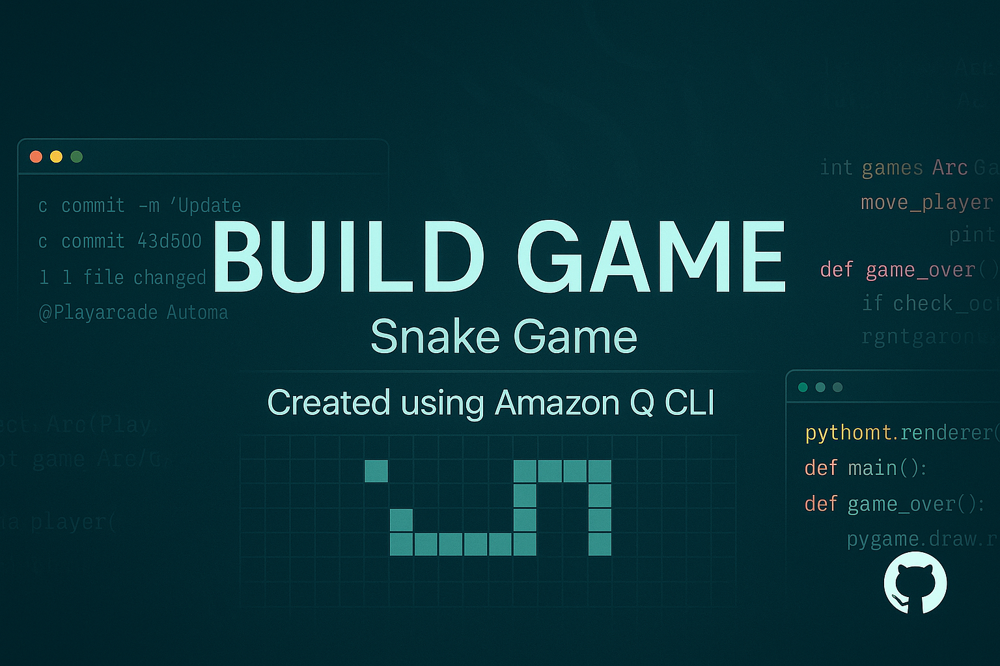

# 🐍 Snake Game + Amazon Q CLI Integration

Welcome to my **classic Snake Game**, reimagined with a touch of AI!  
Built using **Python** and **Pygame**, and enhanced by integrating **Amazon Q CLI** for smart command-line interaction and enhanced with **background music & game over sounds**.

> 🎮 Built as part of the [AWS Build Program](https://aws.amazon.com/builders/)

---

## 🚀 Features

- 🐍 Classic snake gameplay with grid-based movement
- 💬 Amazon Q CLI integration for interactive help & suggestions
- 🎨 Colorful graphics with real-time scoring
- 🎵 **Background music** while playing
- 💥 **Game Over sound effects**
- 🧠 Beginner-friendly clean codebase
- ☁️ Works with AWS Builder ID authentication

---

## 📸 Screenshots


> 

---

## 🛠️ Tech Stack

| Technology     | Description                    |
|----------------|--------------------------------|
| Python         | Core language                  |
| Pygame         | Game graphics & loop           |
| Amazon Q CLI   | AI-powered command-line chat   |
| GitHub         | Version control & hosting      |

---

## 🎧 Audio Integration

- `background.mp3` → Looped while playing
- `game_over.wav` → Played when game ends

---

## 🖥️ Setup Instructions

### 🔹 1. Clone the Repo

```bash
git clone https://github.com/your-username/Snake_game.git
cd Snake_game
```
### 🔹 2. Install Dependencies
```bash
pip install pygame
```
### 🔹 3. Run the Game
bash
```
python snake.py
```
### 🤖 Amazon Q CLI Setup (Optional)
If you want to use Amazon Q CLI from terminal:

bash
```
qcli login
qcli chat
More info: Amazon Q CLI Docs
```

🙋

🔗 [GitHub](https://github.com/chudasamapujan)

💼 [LinkedIn](https://www.linkedin.com/in/pujan-chudasama-076a19289/)

⭐ Support & Contributions
Leave a ⭐ star if you like it!

Fork and make your own cool version!

Share your thoughts in Issues or Discussions
